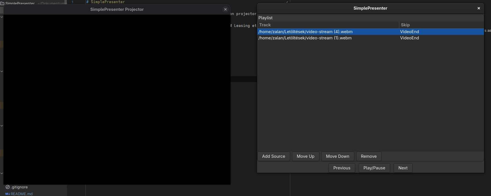

# SimplePresenter

SimplePresenter allows you to schedule videos and display them on projector windows. It is still in very early stages as some basic features don't work.

There is boilerplate setup for future features, like Wayland DRM Leasing etc...

## Screenshots

## For Users

### Installing

Download it from the [releases](releases). Make sure you download [gstreamer](https://gstreamer.freedesktop.org/download/#windows) on Windows.

### Usage

You should first start up the projector application, which will display the address of it's built-in WebSocket server.
You can then connect to it with the GUI application.

You should be careful to write in the server address correctly, **you need to specify the protocol too** (eg.: `ws://127.0.0.1:8765`)!

It's very important that this application doesn't yet share the videos over the network, so you need to be careful that the videos are accessible to the projector.

The automatic skipping doesn't work right now.

## For Developers

1. Clone the repository
2. `cargo run`
